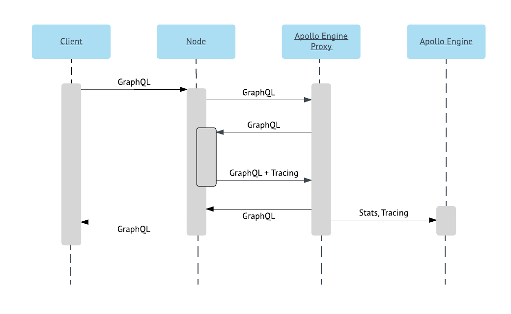

# Apollo Engine

[](https://badge.fury.io/js/apollo-engine)
[](https://travis-ci.org/apollographql/apollo-engine-js)

This package integrates the Apollo Engine proxy with your GraphQL server.

When installed, it starts the Apollo Engine proxy in a new process, then routes
GraphQL requests through that proxy:



# Release Notes

Please see our [Release Notes](https://www.apollographql.com/docs/engine/proxy-release-notes.html) in the Engine documenation.

# Usage
```js
import { Engine } from 'apollo-engine';

// create new engine instance from JS config object
const engine = new Engine({ engineConfig: { ... } });

// create new engine instance from file
const engine = new Engine({ engineConfig: 'path/to/config.json' });

await engine.start();
app.use(engine.expressMiddleware());

// ...
// other middleware / handlers
// ...
```

To shut down engine
```js
engine.stop();
```

The graphql server should have tracing enabled if available. If you are using Apollo Server (v1.1.0 or newer), enable the `tracing: true` configuration option.

# Minimum Engine Configuration
This is the minimum necessary information in the engine configuration object to enable sending tracing and telemetry information.

```json
{
  "apiKey": "service:xxxxxxxxxxxxxxxxxxxxxxxxxxxxxxxxxxxxxxx"
}
```

# Full Engine Configuration

See the documentation section on [configuring the proxy](https://www.apollographql.com/docs/engine/proto-doc.html)
